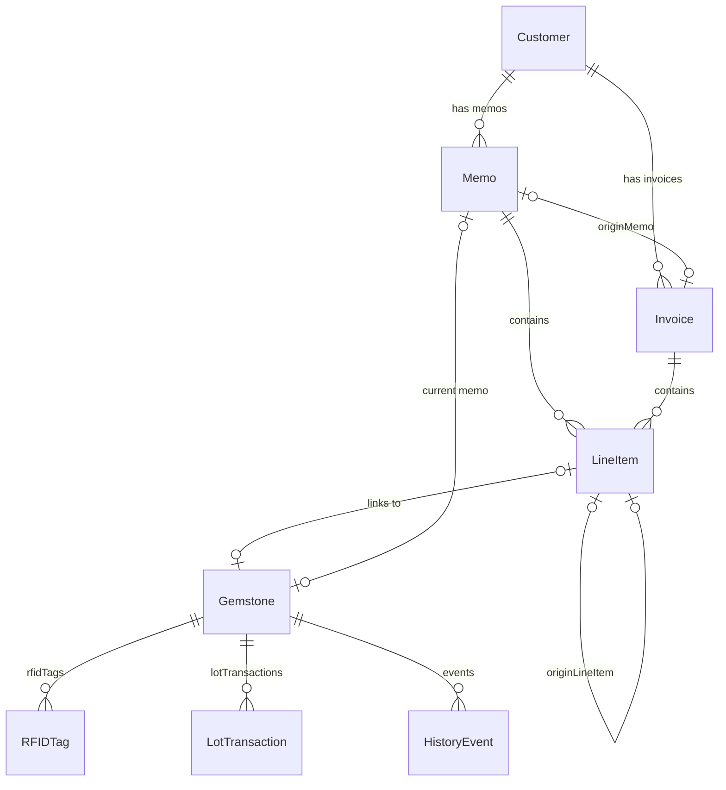

# QDI Gemstone ERP — Developer Handoff Document

> **Last updated:** March 2026
> **Owner:** Quality Diajewels Inc.
> **Platform:** macOS (native, offline-first)

---

## Table of Contents

1. [Business Context](#1-business-context)
2. [Tech Stack & Architecture](#2-tech-stack--architecture)
3. [Repository Layout](#3-repository-layout)
4. [Directory Tree](#4-directory-tree)
5. [Data Models](#5-data-models)
6. [Entity Relationship Diagram](#6-entity-relationship-diagram)
7. [Services Layer](#7-services-layer)
8. [ViewModels Layer](#8-viewmodels-layer)
9. [Views Layer](#9-views-layer)
10. [Utilities & Extensions](#10-utilities--extensions)
11. [RFID System](#11-rfid-system)
12. [Zebra RFID Label Printing](#12-zebra-rfid-label-printing)
13. [PDF Generation](#13-pdf-generation)
14. [Test Coverage](#14-test-coverage)
15. [Dependencies](#15-dependencies)
16. [App Entry & Window Architecture](#16-app-entry--window-architecture)
17. [Key Business Workflows](#17-key-business-workflows)
18. [Known Issues & In-Progress Work](#18-known-issues--in-progress-work)
19. [Quick Reference Table](#19-quick-reference-table)

---

## 1. Business Context

QDI Gemstone ERP is a custom inventory and transaction management system built for **Quality Diajewels Inc.**, a gemstone and diamond dealer. The core business workflow is:

1. **Acquire stones** (diamonds, rubies, sapphires, emeralds, tanzanite) — enter into inventory with SKU, grading, pricing.
2. **Send stones on memo** (consignment) to customers — stones leave the safe but are not yet sold.
3. **Convert memo items to invoices** when customers buy — or **return** items back to stock.
4. **Track everything** with RFID tags on physical labels, enabling scan-based inventory reconciliation.

Stones can be **single**, **pair**, or **lot** (bulk quantity tracked by remaining carats). The app handles all three groupings with different UI flows and transaction logic.

### Key Users
- Gemstone dealer staff entering inventory and creating memos/invoices at a desktop Mac.
- Uses a **Zebra ZD611R** RFID printer for label printing and a **Kcosit/Silion handheld USB reader** for scanning.

---

## 2. Tech Stack & Architecture

| Aspect | Detail |
|--------|--------|
| Language | Swift 5.0 (v1), Swift 6.0 with strict concurrency (v2) |
| UI | SwiftUI (macOS target, minimum macOS 14.0) |
| Database | SwiftData (local persistence, `~/Library/Application Support/QDI_GemstoneERP/default.store`) |
| Architecture | MVVM (Model-View-ViewModel) |
| Hardware I/O | USB serial (POSIX `termios`) for RFID reader, TCP socket (port 9100) for Zebra printer |
| PDF | HTML-to-PDF via `WKWebView` |
| Package Manager | Xcode SPM (not standalone Package.swift) |

### Two App Targets

The repository contains **two separate Xcode projects**:

| | v1 (`QDI_Gemstone_ERP`) | v2 (`QDI_Gemstone_ERP_v2`) |
|---|---|---|
| Status | **Active / production** | Parallel redesign (not yet shipping) |
| Bundle ID | `com.qualitydiajewels.QDI-Gemstone-ERP` | `com.qdi.gemapp.v2` |
| Swift | 5.0 | 6.0 + `SWIFT_STRICT_CONCURRENCY: complete` |
| UI approach | Single `DesignTokens.swift` with all styles | Dedicated `DesignSystem/` folder (components, modifiers, theme tokens) |
| Codegen | Manual `.pbxproj` | `project.yml` for XcodeGen |
| Zebra printing | Yes (`ZebraPrintService`) | Not yet ported |
| Service layer | Mixed (some logic in views, some in VMs) | Clean service enums (`InvoiceService`, `MemoService`, `LotService`, `TransactionService`) |

**v1 is the app currently in use.** The rest of this document focuses on v1 unless noted.

---

## 3. Repository Layout

```
GEMAPP/
├── QDI_Gemstone_ERP/                # v1 app source (ACTIVE)
│   ├── Models/                      # SwiftData @Model classes
│   ├── Views/                       # All SwiftUI views (flat)
│   ├── ViewModels/                  # Observable view models
│   ├── Services/                    # Business logic & hardware I/O
│   ├── Utilities/                   # Design tokens, formatters, guards
│   ├── Assets.xcassets/             # App icon, accent color
│   ├── QDI_Gemstone_ERPApp.swift    # @main entry point
│   └── QDI_Gemstone_ERP.entitlements
├── QDI_Gemstone_ERP.xcodeproj/      # v1 Xcode project
├── QDI_Gemstone_ERPTests/           # Unit tests (RFID)
├── QDI_Gemstone_ERP_v2/             # v2 redesign (PARALLEL)
│   ├── App/                         # Entry point + constants
│   ├── Models/ + Models/Enums/      # Cleaner model split
│   ├── Views/ (feature folders)     # Organized by feature
│   ├── ViewModels/                  # More VMs than v1
│   ├── Services/ + Services/RFID/   # Clean service layer
│   ├── DesignSystem/                # Components, modifiers, theme
│   ├── Utilities/ + Extensions/     # Helpers
│   ├── Resources/                   # Assets, entitlements
│   └── project.yml                  # XcodeGen config
├── prd.md                           # Product requirements document
├── PLAN.md                          # UI refactor plan
├── CODEBASE_REVIEW.md               # RFID/inventory review notes
└── .cursor/                         # Cursor IDE config & plans
```

---

## 4. Directory Tree

### v1: `QDI_Gemstone_ERP/`

```
QDI_Gemstone_ERP/
├── QDI_Gemstone_ERPApp.swift
├── QDI_Gemstone_ERP.entitlements
├── Assets.xcassets/
│
├── Models/
│   ├── Customer.swift
│   ├── Gemstone.swift          # Also contains RFIDTag, StoneType, GemstoneStatus, RFIDTagLifecycleStatus
│   ├── HistoryEvent.swift
│   ├── Invoice.swift
│   ├── LineItem.swift
│   ├── LotTransaction.swift
│   └── Memo.swift
│
├── Services/
│   ├── ZebraPrintService.swift  # Zebra ZD611R TCP + ZPL + RFID encoding
│   ├── RFIDScanService.swift    # EPC normalization + tag assignment logic
│   ├── RFIDService.swift        # Protocol for RFID hardware abstraction
│   ├── RFIDManager.swift        # Silion USB-serial reader implementation
│   ├── PDFService.swift         # HTML→PDF for invoices/memos
│   ├── DemoDataManager.swift    # Reset/seed demo data
│   ├── DataSeeder.swift         # First-launch seeding
│   └── HistoryLogger.swift      # Insert HistoryEvent records
│
├── ViewModels/
│   ├── DashboardViewModel.swift
│   ├── InventoryViewModel.swift
│   ├── TransactionViewModel.swift
│   ├── ScannerViewModel.swift
│   ├── ReconcileViewModel.swift
│   └── RFIDCoordinator.swift
│
├── Views/
│   ├── AppShellView.swift        # Root: sidebar + routed content
│   ├── SidebarView.swift         # Navigation sidebar
│   ├── DashboardView.swift       # Main dashboard
│   ├── DashboardSections.swift   # Dashboard sub-components
│   ├── DashboardComponents.swift # Reusable cards/badges
│   ├── InventoryListView.swift   # Gemstone inventory table
│   ├── InventoryFilterPanel.swift
│   ├── InventoryTableViews.swift
│   ├── GemstoneDetailView.swift  # Stone inspector panel
│   ├── LotInventoryView.swift    # Lot stones list
│   ├── LotHistorySheet.swift
│   ├── AddLotQuantitySheet.swift
│   ├── QuickIntakeView.swift     # Fast stone entry
│   ├── ReviewQueueView.swift     # Review flagged stones
│   ├── ReviewEditSheet.swift
│   ├── StoneFormView.swift       # Intake/edit/review form
│   ├── StoneFormLogic.swift
│   ├── StoneFormIntakeSections.swift
│   ├── StoneFormEditSections.swift
│   ├── StoneFormReviewBody.swift
│   ├── ScannerView.swift         # RFID scan UI
│   ├── InventoryReconcileView.swift  # RFID reconciliation
│   ├── UnknownTagAssignSheet.swift   # Assign unknown RFID tag
│   ├── MemosView.swift           # Memo list
│   ├── MemoDocumentView.swift    # Memo detail/editor
│   ├── MemoWindowView.swift      # Memo in separate window
│   ├── InvoiceListView.swift     # Invoice list
│   ├── InvoiceDetailView.swift   # Invoice detail/editor
│   ├── InvoiceWindowView.swift   # Invoice in separate window
│   ├── TransactionEditorView.swift
│   ├── TransactionEditorSections.swift
│   ├── TransactionSaveLogic.swift
│   ├── EditableLineItemRow.swift
│   ├── CustomerListView.swift
│   ├── CustomerDetailView.swift
│   ├── AddCustomerSheet.swift
│   ├── InventorySelectSheet.swift  # Pick stones for memo/invoice
│   ├── LotSelectSheet.swift        # Pick lot + carats
│   ├── AccountingView.swift        # Financial reports
│   ├── AddGemstoneView.swift       # Simple add stone form
│   ├── AutocompleteFieldView.swift # Generic dropdown
│   └── PrintTagButton.swift        # Zebra print UI + config
│
└── Utilities/
    ├── DesignTokens.swift          # Full design system (colors, typography, components)
    ├── CurrencyFormatter.swift     # Decimal.asCurrency
    ├── SKUGenerator.swift          # TYPE-SHAPE-GROUP-NNN scheme
    ├── DocumentDirtyTracker.swift   # Unsaved changes tracking
    ├── NavigationGuard.swift        # Prevent nav with unsaved edits
    ├── LineItemColumnLayout.swift   # Table column widths
    └── QuickIntakeEnums.swift       # IntakeShape, IntakeGrouping
```

---

## 5. Data Models

All models use SwiftData `@Model` and live in `QDI_Gemstone_ERP/Models/`.

### Gemstone

The central entity. Represents a single stone, a pair, or a lot.

| Property | Type | Notes |
|----------|------|-------|
| `sku` | `String` | Auto-generated `TYPE-SHAPE-GROUP-NNN` |
| `stoneType` | `StoneType` | `.diamond`, `.emerald`, `.ruby`, `.sapphire`, `.tanzanite` |
| `caratWeight` | `Double` | Total carats (for lots: original amount) |
| `color`, `clarity`, `cut` | `String` | Grading fields |
| `origin` | `String` | Country of origin |
| `costPrice`, `sellPrice` | `Decimal` | Pricing |
| `status` | `GemstoneStatus?` | `.available`, `.onMemo`, `.sold` |
| `shape` | `String?` | Round, oval, cushion, etc. |
| `grouping` | `String?` | single / pair / lot |
| `treatment` | `String?` | Heat treatment, etc. |
| `hasCert`, `certLab`, `certNo` | `Bool?`, `String?`, `String?` | Certificate info |
| `length`, `width`, `height` (+ `2` variants) | `Double?` | Dimensions |
| `polish`, `symmetry`, `fluorescence` | `String?` | Diamond-specific grading |
| `size`, `quality` | `String?` | Lot-specific |
| `remainingCarats` | `Double?` | Lot: current stock after sales |
| `averageCostPerCarat` | `Decimal?` | Lot: weighted average cost |
| `rfidEpc` | `String?` | Assigned RFID EPC hex |
| `rfidTid` | `String?` | Tag hardware ID |
| `rfidAssignedAt`, `rfidLastSeenAt` | `Date?` | RFID timestamps |
| `rfidStatus` | `String?` | Lifecycle status string |
| `rfidTag` | `String?` | Legacy field (migrated to `rfidEpc`) |
| `certificateImagePath`, `mediaPathsJson` | `String?` | Media attachments |
| `memo` | `Memo?` | Current memo if on consignment |
| `rfidTags` | `[RFIDTag]` | Relationship (inverse: `assignedStone`) |
| `lotTransactions` | `[LotTransaction]` | Cascade delete |
| `events` | `[HistoryEvent]` | History timeline |

**Computed:** `isLot`, `effectiveRemainingCarats`, `effectiveAverageCost`, `effectiveStatus`, `effectiveRfidEpc`, `mediaPaths`, `currentLocation`, review flags (`needsReview`).

### RFIDTag

Separate entity to track physical RFID tags independently of stones.

| Property | Type | Notes |
|----------|------|-------|
| `epcCurrent` | `String` | `@Attribute(.unique)` — canonical EPC hex |
| `tidLastVerified` | `String?` | Hardware tag ID |
| `status` | `RFIDTagLifecycleStatus` | `unassigned` → `pending` → `printRequested` → `printed` → `encoded` → `verified` → `assigned` → `failed` / `retired` |
| `firstSeenAt`, `lastSeenAt`, `lastVerifiedAt` | `Date?` | Timestamps |
| `printerJobID` | `String?` | Zebra print job reference |
| `notes` | `String?` | Free text |
| `assignedStone` | `Gemstone?` | Inverse of `Gemstone.rfidTags` |

### Customer

| Property | Type | Notes |
|----------|------|-------|
| `name`, `firstName`, `lastName` | `String?` | Display name fields |
| `company`, `email`, `phone` | `String?` | Contact |
| `address`, `city`, `country`, `zip` | `String?` | Address block |
| `createdAt` | `Date` | |
| `memos` | `[Memo]?` | Inverse relationship |
| `invoices` | `[Invoice]?` | Inverse relationship |

**Computed:** `displayName`, `activeMemos`, `openExposure`, `formattedAddress`.

### Memo

Consignment document. A customer borrows stones.

| Property | Type | Notes |
|----------|------|-------|
| `status` | `MemoStatus` | `.inStock`, `.onMemo`, `.sold`, `.returned` |
| `dateAssigned`, `dateCompleted` | `Date?` | |
| `notes` | `String?` | |
| `referenceNumber` | `String?` | Auto-incremented from 1001 |
| `customer` | `Customer?` | |
| `lineItems` | `[LineItem]` | Inverse relationship |

**Computed:** `totalAmount`, `openLineItems`, `openMemoAmount`, `isClosed`.

### Invoice

Sales document. Customer buys stones.

| Property | Type | Notes |
|----------|------|-------|
| `invoiceDate` | `Date` | |
| `dueDate` | `Date?` | |
| `terms`, `notes` | `String?` | Net 30, etc. |
| `referenceNumber` | `String?` | Auto-incremented from 2001 |
| `status` | `InvoiceStatus?` | `.draft`, `.sent`, `.paid`, `.void` |
| `customer` | `Customer?` | |
| `originMemo` | `Memo?` | If converted from memo |
| `lineItems` | `[LineItem]` | Inverse relationship |

**Computed:** `effectiveStatus`, `totalAmount`.

### LineItem

Shared by both Memo and Invoice. Three types of line items:

| Property | Type | Notes |
|----------|------|-------|
| `sku` | `String` | |
| `itemDescription` | `String` | Auto-filled or manual |
| `carats` | `Double` | |
| `rate`, `amount` | `Decimal` | Editable price, computed total |
| `gemstone` | `Gemstone?` | `nil` for brokered/service items |
| `invoice` | `Invoice?` | |
| `memo` | `Memo?` | |
| `originLineItem` | `LineItem?` | Self-referential (memo→invoice conversion) |
| `isService` | `Bool` | True = service/fee line |
| `brokeredStoneType` | `String?` | Non-nil = brokered stone (no inventory link) |
| `isLotLineItem` | `Bool` | From lot quantity |
| `lockedCostPerCarat` | `Decimal?` | Snapshot at transaction time |
| `status` | `LineItemStatus?` | `.open`, `.returned`, `.sold` |
| `returnedDate`, `soldDate` | `Date?` | |

**Line item kinds** (determined by properties, not an explicit enum in v1):
- **Inventory stone:** `gemstone != nil`, `isService == false`, `brokeredStoneType == nil`
- **Brokered stone:** `gemstone == nil`, `brokeredStoneType != nil`
- **Service/fee:** `isService == true`

### LotTransaction

Tracks quantity changes for lot-type gemstones.

| Property | Type | Notes |
|----------|------|-------|
| `type` | `LotTransactionType` | `.added`, `.sold`, `.returned`, `.onMemo` |
| `carats` | `Double` | Quantity moved |
| `date` | `Date` | |
| `pricePerCarat`, `totalPrice` | `Decimal` | |
| `lockedCostPerCarat` | `Decimal?` | Cost snapshot |
| `notes` | `String?` | |
| `gemstone` | `Gemstone?` | Parent lot |

**Computed:** `profitPerCarat`, `totalProfit`.

### HistoryEvent

Audit trail for gemstones.

| Property | Type | Notes |
|----------|------|-------|
| `date` | `Date` | |
| `eventDescription` | `String` | Human-readable message |
| `eventType` | `HistoryEventType` | `.dateAdded`, `.sentToCustomer`, `.returnedFromCustomer`, `.sold` |
| `gemstone` | `Gemstone?` | |

---

## 6. Entity Relationship Diagram



---

## 7. Services Layer

All services live in `QDI_Gemstone_ERP/Services/`.

### ZebraPrintService (`ZebraPrintService.swift`)

RFID label printing via Zebra ZD611R over TCP/IP.

| Method | Purpose |
|--------|---------|
| `printAndEncode(stone:modelContext:) async throws` | Builds ZPL, sends to printer via TCP port 9100, registers EPC in DB |
| `checkConnection() async -> Bool` | Sends `~HS` status query to verify connectivity |
| `generateEPC(for:) -> String?` | Deterministic 12-byte EPC: prefix `E280` + first 10 bytes of `SHA256(SKU)` → 24 hex chars |
| `buildZPL(for:epc:) -> String` | Assembles ZPL for the selected print profile |

**Print Profiles:** 5 profiles (`PrintProfile` enum). **Setting 2** is the working profile with RFID encoding. Uses `^RS8,F{mm}` for programming position and `^RFW,H` for EPC writes.

**Environment injection:** `EnvironmentValues.zebraPrintService` (optional).

**Stored settings:** Printer IP and profile in `UserDefaults`.

### RFIDScanService (`RFIDScanService.swift`)

Stateless static enum for EPC processing and tag-to-stone assignment.

| Method | Purpose |
|--------|---------|
| `processScannedTag(rawHex:modelContext:) -> ScanResult` | Canonicalize hex, look up RFIDTag/Gemstone, update `lastSeen` |
| `assignTagToStone(epc:tid:stone:replaceExisting:modelContext:) -> AssignmentResult` | Write EPC to Gemstone + create/update RFIDTag, handle conflicts |
| `evaluateAssignmentConflict(_:) -> AssignmentConflict?` | Pure conflict detection (EPC/TID already used elsewhere) |
| `migrateLegacyFieldsIfNeeded(modelContext:)` | One-time migration from legacy `rfidTag` field to `rfidEpc` |

**Also defines:** `EPCanonical` — EPC normalization/validation utility (canonical 24-char hex with `E280` prefix rules).

### RFIDService (`RFIDService.swift`)

Protocol abstracting RFID hardware. Allows mocking.

```swift
protocol RFIDService {
    var onTagDiscovered: ((String) -> Void)? { get set }
    func startScanning()
    func stopScanning()
}
```

**Environment keys:** `\.rfidService`, `\.rfidCoordinator`.

### RFIDManager (`RFIDManager.swift`)

Concrete implementation of `RFIDService`. Drives the Silion USB-serial RFID reader.

| Method | Purpose |
|--------|---------|
| `startScanning()` | Open serial port, send Silion startup sequence (version → boot → async inventory) |
| `stopScanning()` | Stop async inventory, close file descriptor |
| `autoConnect()` | Find first `usbserial` / `cu.` port and connect |
| `reconnect()` | Reset backoff, restart scanning |
| `pauseScanning()` / `resumeScanning()` | Pause/resume without disconnecting |
| `resetScanSession()` | Clear dedup set + counters |

**Protocol:** Silion framing — `FF LEN CMD [DATA...] CRC_H CRC_L`, CRC16-CCITT (poly `0x1021`, init `0xFFFF`). Tag events on CMD `0xAA`. 300ms dedup. Auto-reconnect with 2s→10s backoff.

**Dependencies:** POSIX `open`/`read`/`write`/`ioctl`/`termios`, `ORSSerialPort` (for port enumeration), `DispatchSource` for async reads.

### PDFService (`PDFService.swift`)

Singleton for generating invoice/memo PDFs.

| Method | Purpose |
|--------|---------|
| `generatePDF(invoice:completion:)` | Invoice HTML template → WKWebView → temp PDF file |
| `generatePDF(memo:completion:)` | Memo HTML template → WKWebView → temp PDF file |
| `saveCompanyLogo(_:)` | Store logo PNG in UserDefaults |

**Template:** Clean professional style with company logo (base64), customer address block, line item table, totals, signature line.

### DemoDataManager (`DemoDataManager.swift`)

Static methods for demo data lifecycle.

| Method | Purpose |
|--------|---------|
| `resetAllData(modelContext:)` | Delete all → seed fresh |
| `deleteAllData(modelContext:)` | Wipe all entity types |
| `seedDemoData(modelContext:)` | 10 customers, 30 stones, lots, 12 memos, 10 invoices, history events |

### DataSeeder (`DataSeeder.swift`)

| Method | Purpose |
|--------|---------|
| `seedIfNeeded(modelContext:)` | If no gemstones exist, seed a small sample |

### HistoryLogger (`HistoryLogger.swift`)

| Function | Purpose |
|----------|---------|
| `logEvent(stone:type:message:modelContext:)` | Insert a `HistoryEvent` and save |

---

## 8. ViewModels Layer

All in `QDI_Gemstone_ERP/ViewModels/`. Use `@Observable` pattern.

### DashboardViewModel
- **State:** `totalCaratsInStock`, `totalValueOnMemo`, `recentActivity: [RecentActivityItem]`, `oldestOpenMemos: [OldestMemoItem]`, `inventorySnapshot`
- **Role:** Aggregates dashboard KPIs from SwiftData queries

### InventoryViewModel
- **State:** All filter fields (search text, status, stone type, shape, certified, treatment, grouping, carat/price ranges, color, clarity)
- **Enums:** `InventoryStatusFilter`, `InventoryStoneTypeFilter`, `CertifiedFilter`, `ActiveFilterPill`
- **Role:** Drives the inventory list filtering UI

### TransactionViewModel
- **State:** Customer, dates, terms, reference number, notes, tax rate, `lineItems: [DraftLineItem]`, `lastRFIDMessage`
- **Role:** Drives memo/invoice editor. Contains static helpers for creating memos/invoices, adding stones/lots/brokered/service lines, handling scanned tags, saving, and deleting transactions

### ScannerViewModel
- **State:** `isScanning`, `lastDiscoveredTagID`, `discoveredTagIDs: Set`, `lastProcessResult`
- **Role:** Bridges `RFIDService` tag callbacks to UI

### ReconcileViewModel
- **State:** `availableStones`, `scannedTagIDs`, `foundTagIDs`, `extraScanReasons`, `isScanning`
- **Role:** RFID inventory reconciliation (missing/found/extra columns)

### RFIDCoordinator
- **State:** `pendingUnknownTag: (epc, tid)?`, `showAssignModal`, `assignSuccessMessage`
- **Role:** Coordinates unknown-tag-to-stone assignment modal flow

---

## 9. Views Layer

All in `QDI_Gemstone_ERP/Views/`. Navigation is route-based via `AppShellView`.

### Shell & Navigation

| View | Purpose |
|------|---------|
| **AppShellView** | Root view: `HStack` of `SidebarView` + header + routed content. Injects RFID services. Hosts `UnknownTagAssignSheet`. |
| **SidebarView** | Grouped navigation list. Sections: Get Started, Sales, Inventory. `NavigationItem` enum. |

### Dashboard

| View | Purpose |
|------|---------|
| **DashboardView** | 2-column: left scroll (KPIs, quick actions, recent activity, reset button) + right info panel. |
| **DashboardSections** | Sub-components for dashboard sections. |
| **DashboardComponents** | Reusable: `SectionHeader`, `StatusPill`, `AppCard`, `DashboardActionCard`, `DashboardWidgetCard`. |

### Inventory

| View | Purpose |
|------|---------|
| **InventoryListView** | Gemstone table with filters, summary bar, inspector panel. Modes: available, on memo, sold. |
| **InventoryFilterPanel** | Filter controls (extension on InventoryListView). |
| **InventoryTableViews** | Table column definitions (extension). |
| **GemstoneDetailView** | Stone inspector: overview, grading, pricing, RFID section (with `PrintTagButton`), cert, media, history timeline. |
| **LotInventoryView** | Lot stones list with search, sort, summary strip. Sheets: history, add quantity. |
| **LotHistorySheet** | Shows `LotTransaction` list for a lot. |
| **AddLotQuantitySheet** | Form to add carats to a lot (inserts `LotTransaction`). |

### Stone Forms

| View | Purpose |
|------|---------|
| **QuickIntakeView** | Wraps `StoneFormView(mode: .intake)` with dirty guard. |
| **StoneFormView** | Multi-mode form: intake (new), edit, review. Heavy `@State` fields. |
| **StoneFormLogic** | Save/validation logic for the form. |
| **StoneFormIntakeSections** | Intake-mode form sections. |
| **StoneFormEditSections** | Edit-mode form sections. |
| **StoneFormReviewBody** | Review-mode read-only display with edit actions. |
| **ReviewQueueView** | Lists stones flagged for review. Opens `StoneFormView` in review mode. |
| **ReviewEditSheet** | Quick edit sheet for cert/dimensions/grading/pricing. |
| **AddGemstoneView** | Simple add-stone form (inserts Gemstone + history). |

### Scanner & RFID

| View | Purpose |
|------|---------|
| **ScannerView** | RFID scan UI: status, start/stop, discovered tags grid. |
| **InventoryReconcileView** | RFID reconciliation: scan all tags → compare to DB → show missing/found/extra. |
| **UnknownTagAssignSheet** | Assign a scanned unknown EPC/TID to a Gemstone. |

### Transactions (Memos & Invoices)

| View | Purpose |
|------|---------|
| **MemosView** | Memo list with open/closed tabs. Opens memo in separate window. |
| **MemoDocumentView** | Memo detail: header, selectable line items, totals. Convert-to-invoice flow. |
| **MemoWindowView** | Wraps `MemoDocumentView` in a standalone `WindowGroup`. |
| **InvoiceListView** | Invoice list table. Opens invoice in separate window. |
| **InvoiceDetailView** | Invoice detail: header, editable lines, totals, mark paid, PDF export. |
| **InvoiceWindowView** | Wraps `InvoiceDetailView` in a standalone `WindowGroup`. |
| **TransactionEditorView** | Shared editor for memo/invoice creation (header, line list, footer). |
| **TransactionEditorSections** | Editor section helpers. |
| **TransactionSaveLogic** | `saveInvoice`, `saveMemo`, `saveEditedMemo` with history logging. |
| **EditableLineItemRow** | Inline-editable line item row for tables. |

### Selection Sheets

| View | Purpose |
|------|---------|
| **InventorySelectSheet** | Pick available gemstones (non-lot) for a transaction. Multi-select. |
| **LotSelectSheet** | Pick a lot stone + specify carats to deduct. |

### Customers

| View | Purpose |
|------|---------|
| **CustomerListView** | Customer table + inspector with `CustomerDetailView`. |
| **CustomerDetailView** | Contact info, active memos, past purchases. |
| **AddCustomerSheet** (`CustomerFormSheet`) | Add/edit customer form. Available from customer list and inline from transaction editors. |

### Accounting

| View | Purpose |
|------|---------|
| **AccountingView** | Date range selector, KPI cards, tabs (Overview/Transactions), aged receivables, sales by type/month, CSV export. |

### Printing

| View | Purpose |
|------|---------|
| **PrintTagButton** | Zebra print button (`.pill`, `.contextMenu`, `.icon` variants). Uses `ZebraPrintService`. |
| **PrinterConfigView** (inside PrintTagButton.swift) | Printer IP, profile selector, connection test. |

### Other

| View | Purpose |
|------|---------|
| **AutocompleteFieldView** | Generic dropdown/autocomplete text field. |

---

## 10. Utilities & Extensions

All in `QDI_Gemstone_ERP/Utilities/`.

### DesignTokens.swift

The entire v1 design system in one file. Contains:

- **`AppColors`** — backgrounds, primary/accent, semantic colors, stone-type colors, gradients
- **`AppSpacing`** — xs (4) / s (8) / m (12) / l (16) / xl (24)
- **`AppCornerRadius`** — s (6) / m (10) / l (14)
- **`AppTypography`** — header, subheader, body, caption, mono styles
- **`AppShadows`** — card/dropdown shadows
- **Reusable views:** `AppSurfaceCard`, `GlassCard`, `GradientButton`, `StoneTypeBadge`, `AppStatusBadge`, `FilterPill`, `GlassSearchField`, `AppTableHoverRow`, `AppTableHeader`
- **View modifiers:** `.glassField()`, `.appSearchField()`, `.glassCardBackground()`, `.captionLabel()`, `.sectionLabel()`, `.glassTable()`
- **Button styles:** `GradientButtonStyle`, `OutlineGlassButtonStyle`
- **`InspectorWidth`** — min/ideal/max for side panels
- **`Notification.Name.memoOrInvoiceDidSave`**

### CurrencyFormatter.swift

- `Decimal.asCurrency` computed property → USD formatted string
- `CurrencyHelper.shared` — `NumberFormatter` (`.currency`, USD, `en_US`)

### SKUGenerator.swift

Auto-generates SKUs in format `TYPE-SHAPE-GROUP-NNN` (e.g., `DIA-RD-S-001`).

| Function | Purpose |
|----------|---------|
| `generateSKU(...)` | Next available SKU for type/shape/grouping |
| `resolveSKUForSave(...)` | Generate if empty, else ensure unique |
| `resolveSKUForEdit(...)` | Edit rules + uniqueness (excluding self) |
| `skuExists(...)` | DB uniqueness check |
| `findSKUTypeMismatches(...)` | Debug: find SKUs that don't match their stone type |

### DocumentDirtyTracker.swift

- `@Observable` class tracking `hasUnsavedMemo` and `hasUnsavedInvoice`
- `onSaveAndClose` callback
- Injected via `EnvironmentValues.documentDirtyTracker`

### NavigationGuard.swift

- `@Observable` class with `reportDirty(_:onDiscard:)` and `clearDirty()`
- Shows confirmation alert when navigating away from unsaved edits
- Injected via `EnvironmentValues.navigationGuard`

### LineItemColumnLayout.swift

Fixed `CGFloat` column widths for memo/invoice tables: `sku`, `stoneType`, `descriptionMin`, `carats`, `rate`, `amount`, `status`, `check`.

### QuickIntakeEnums.swift

- `IntakeShape` — round, oval, cushion, emerald, pear, marquise, princess, radiant, asscher, heart, trillion, baguette, other
- `IntakeGrouping` — single, pair, lot

---

## 11. RFID System

### Hardware

| Device | Role | Interface |
|--------|------|-----------|
| **Kcosit / Silion handheld reader** | Scan RFID tags on gemstone labels | USB-serial (`/dev/cu.usbserial*`), 115200 baud, 8N1 |
| **Zebra ZD611R** | Print + encode RFID labels | TCP/IP port 9100 (ZPL) |

### Scan Flow

```
Physical tag scan
       │
       ▼
RFIDManager (USB serial)
  ├─ Silion frame: FF LEN CMD DATA CRC
  ├─ CMD 0xAA = tag event
  ├─ Extract raw hex EPC
  └─ 300ms dedup
       │
       ▼
onTagDiscovered callback
       │
       ▼
ScannerViewModel / ReconcileViewModel
       │
       ▼
RFIDScanService.processScannedTag()
  ├─ EPCanonical.normalize() → 24-char hex
  ├─ Look up RFIDTag by epcCurrent
  ├─ Fallback: look up Gemstone by rfidEpc
  └─ Return: .knownStone(Gemstone) | .unknownTag(epc) | .invalidEPC
       │
       ▼
UI: show stone detail OR prompt to assign
```

### EPC Generation (for printing)

Deterministic from SKU:
1. `SHA256(stone.sku)` → 32 bytes
2. Take first 10 bytes
3. Prepend `[0xE2, 0x80]` → 12 bytes
4. Hex encode → 24 characters (e.g., `E280A1B2C3D4E5F6A7B8C9D0`)

### Tag Assignment

`RFIDScanService.assignTagToStone(epc:tid:stone:replaceExisting:modelContext:)`:
1. Check if EPC already assigned to another stone (conflict)
2. Create or update `RFIDTag` entity
3. Set `Gemstone.rfidEpc`, `rfidTid`, `rfidAssignedAt`
4. Clear legacy `rfidTag` field
5. Return `.assigned`, `.replaced`, or `.conflict(message)`

---

## 12. Zebra RFID Label Printing

### Label Specs
- **Size:** 25.4mm x 13.9mm (203 x 111 dots at 203 DPI)
- **Content:** 3 lines — SKU, stone description, cost code + sell price
- **RFID inlay:** Embedded in label, encoded during print

### ZPL Structure (Setting 2)

```
^XA
^CI28
^PW203
^LL130
^PR2,2
^MD20
^LH0,0
^RS8,F{mm}                          ← RFID setup: Gen2, forward program position
^RFW,H,2,12,1^FD{24-char EPC}^FS   ← Explicit EPC bank write
^RFW,H,,,A^FD{24-char EPC}^FS      ← Auto-PC fallback write
^FO22,46^A0N,24,20^FD{SKU}^FS      ← Line 1
^FO22,76^A0N,20,16^FD{description}^FS  ← Line 2
^FO22,102^A0N,20,16^FD{price}^FS   ← Line 3
^XZ
```

### Current Status

RFID encoding is **intermittently working**. The challenge is aligning the inlay with the printer's RF antenna sweet spot on small jewelry labels. Current approach tries multiple forward programming positions (`F5`, `F6`, `F7`, `F8`) per label. See [Known Issues](#18-known-issues--in-progress-work).

---

## 13. PDF Generation

`PDFService.shared` generates HTML-to-PDF via `WKWebView`.

### Template
- **Header:** Company logo (base64 from UserDefaults) + company info + document title
- **Customer block:** "Bill To" with full address
- **Metadata:** Reference number, date, due date, terms
- **Table:** SKU, Description, Carats, Rate, Amount columns
- **Footer:** Subtotal, tax, grand total, payment instructions, signature line

### Flow
1. Call `PDFService.shared.generatePDF(invoice:)` or `generatePDF(memo:)`
2. Service builds HTML string with inline CSS
3. Loads into offscreen `WKWebView`
4. Exports PDF to temp directory
5. Returns `URL` via completion handler
6. UI presents via `NSSavePanel` or share sheet

---

## 14. Test Coverage

Tests live in `QDI_Gemstone_ERPTests/`:

| File | Coverage |
|------|----------|
| `RFIDIdentityTests.swift` | `EPCanonical` normalization, validation, hex conversion |
| `RFIDAssignmentConflictTests.swift` | `evaluateAssignmentConflict` logic paths |
| `RFIDWorkflowLogicTests.swift` | End-to-end RFID scan → assign → conflict workflows |

Other areas (views, transactions, lot logic) do **not** have automated tests.

---

## 15. Dependencies

| Package | Version | Purpose |
|---------|---------|---------|
| **ORSSerialPort** | 2.1.0 | USB serial port enumeration on macOS |

Resolved via Xcode SPM. No `Package.swift` at repo root.

### System Frameworks Used
- `SwiftData` — persistence
- `SwiftUI` — UI
- `Network` — `NWConnection` for Zebra TCP
- `CryptoKit` — SHA256 for EPC generation
- `WebKit` — `WKWebView` for PDF generation
- `AppKit` — `NSSavePanel`, app lifecycle hooks
- `Darwin` / POSIX — serial port I/O (`open`, `read`, `write`, `ioctl`, `termios`)

### Entitlements (v1)
- `com.apple.security.device.serial = true` — USB serial access for RFID reader

---

## 16. App Entry & Window Architecture

**Entry point:** `QDI_Gemstone_ERPApp.swift`

```swift
@main struct QDI_Gemstone_ERPApp: App {
    // Creates RFIDManager, DocumentDirtyTracker, RFIDCoordinator, ZebraPrintService
    // SwiftData ModelContainer stored at ~/Library/Application Support/QDI_GemstoneERP/default.store

    var body: some Scene {
        WindowGroup { AppShellView() }        // Main window (1200×780)
        WindowGroup(id: "memo") { ... }       // Memo document windows (1320×860)
        WindowGroup(id: "invoice") { ... }    // Invoice document windows (1320×860)
    }
}
```

### Window Model
- **Main window:** `AppShellView` — sidebar + routed content. Always open.
- **Memo windows:** Opened via `openWindow(id: "memo", value: PersistentIdentifier)`. Each memo gets its own window.
- **Invoice windows:** Same pattern with `id: "invoice"`.

### On Launch
1. Seed demo data if DB empty (`DataSeeder.seedIfNeeded`)
2. Migrate legacy RFID fields (`RFIDScanService.migrateLegacyFieldsIfNeeded`)
3. Auto-connect RFID reader (`rfidManager.autoConnect()`)

---

## 17. Key Business Workflows

### Adding a Stone
1. User navigates to Quick Intake (or clicks "Add Stone" on Dashboard)
2. Fills `StoneFormView` (type, shape, grouping, grading, pricing)
3. SKU auto-generated by `SKUGenerator`
4. Stone saved to SwiftData with status `.available`
5. `HistoryEvent` logged (`.dateAdded`)
6. If lot: initial `LotTransaction` of type `.added`

### Creating a Memo
1. User clicks "New Memo" → `TransactionViewModel.createNewMemo()` → auto-increment reference number
2. Opens `MemoDocumentView` in new window
3. User selects customer, adds stones via `InventorySelectSheet` (filters to `.available` only)
4. Each added stone: status changes to `.onMemo`, `HistoryEvent` logged (`.sentToCustomer`)
5. Lots: user specifies carats to deduct → `LotTransaction` of type `.onMemo`
6. Can also add brokered stones (manual entry) and service fees

### Returning Memo Items
1. Open memo detail → select items → "Return Selected"
2. Stone status back to `.available`, `HistoryEvent` logged (`.returnedFromCustomer`)
3. Lots: carats restored, `LotTransaction` of type `.returned`
4. When all items returned/sold, memo can be closed

### Memo-to-Invoice Conversion
1. Open memo → "Invoice Selected Items" → selection mode
2. Select items → confirm → creates new `Invoice` pre-filled with:
   - Same customer
   - Selected line items (copied, linked via `originLineItem`)
   - Prices from memo (editable)
3. On invoice save: stones marked `.sold`, `HistoryEvent` logged

### RFID Scan Lookup
1. Scan tag → `RFIDManager` emits raw hex
2. `RFIDScanService.processScannedTag()` normalizes and looks up
3. If known stone → show `GemstoneDetailView`
4. If unknown → show `UnknownTagAssignSheet` to assign to a stone

### Printing an RFID Label
1. Open stone detail → RFID section → click "Print & Encode"
2. `ZebraPrintService.printAndEncode()`:
   - Generate deterministic EPC from SKU
   - Build ZPL with RFID encode commands
   - Send to Zebra printer via TCP
   - Register EPC in DB via `RFIDScanService.assignTagToStone()`

### Inventory Reconciliation
1. Navigate to Reconcile → start scan
2. `ReconcileViewModel` loads all `.available` stones with RFID EPCs
3. As tags are scanned, categorized into: **Found** (matched), **Missing** (not scanned), **Extra** (scanned but not in expected set)

---

## 18. Known Issues & In-Progress Work

### RFID Encoding (Active)
- Zebra ZD611R RFID encoding on small jewelry labels (25.4mm x 13.9mm) is **intermittent**
- Root cause: inlay position varies slightly label-to-label, causing marginal alignment with the printer's RF antenna
- Current mitigation: sweep multiple forward programming positions (F5-F8) per label
- After print, the app optimistically registers the EPC in the DB even if encoding may have failed
- **Recommended next step:** Add post-print scan verification before DB assignment; run printer RFID media calibration

### Architecture
- v1 has some business logic in Views (especially transaction save logic in `TransactionSaveLogic.swift`)
- v2 has cleaner separation with dedicated service enums but is not yet feature-complete
- `DesignTokens.swift` (v1) is a ~1000-line monolith; v2 properly splits into `DesignSystem/`

### Missing Test Coverage
- No tests for transaction workflows (memo create/return/convert)
- No tests for lot quantity logic
- No tests for SKU generation
- No tests for PDF generation

### v2 Status
- Parallel redesign with Swift 6 strict concurrency
- Has proper service layer (`InvoiceService`, `MemoService`, `LotService`, `TransactionService`)
- Does NOT yet have Zebra printing (`ZebraPrintService` not ported)
- Has `project.yml` for XcodeGen but still needs manual `pbxproj` for some workflows

---

## 19. Quick Reference Table

| What | Where |
|------|-------|
| App entry point | `QDI_Gemstone_ERP/QDI_Gemstone_ERPApp.swift` |
| Root navigation | `Views/AppShellView.swift` + `Views/SidebarView.swift` |
| All data models | `Models/*.swift` (8 files) |
| Gemstone model + RFIDTag + enums | `Models/Gemstone.swift` |
| RFID reader driver | `Services/RFIDManager.swift` |
| RFID scan/assign logic | `Services/RFIDScanService.swift` |
| RFID protocol abstraction | `Services/RFIDService.swift` |
| Zebra printer + ZPL + encoding | `Services/ZebraPrintService.swift` |
| Print button UI | `Views/PrintTagButton.swift` |
| PDF generation | `Services/PDFService.swift` |
| Demo data | `Services/DemoDataManager.swift` + `DataSeeder.swift` |
| SKU generation | `Utilities/SKUGenerator.swift` |
| Design system (v1) | `Utilities/DesignTokens.swift` |
| Design system (v2) | `QDI_Gemstone_ERP_v2/DesignSystem/` |
| Product requirements | `prd.md` |
| RFID tests | `QDI_Gemstone_ERPTests/RFID*.swift` |
| SwiftData store location | `~/Library/Application Support/QDI_GemstoneERP/default.store` |
| Printer settings | `UserDefaults` keys: `ZebraPrinterIP`, `ZebraPrintProfile` |
| SPM dependency | `ORSSerialPort` 2.1.0 (USB serial enumeration) |
| Xcode project (v1) | `QDI_Gemstone_ERP.xcodeproj` |
| Xcode project (v2) | `QDI_Gemstone_ERP_v2/QDI_Gemstone_ERP_v2.xcodeproj` |
